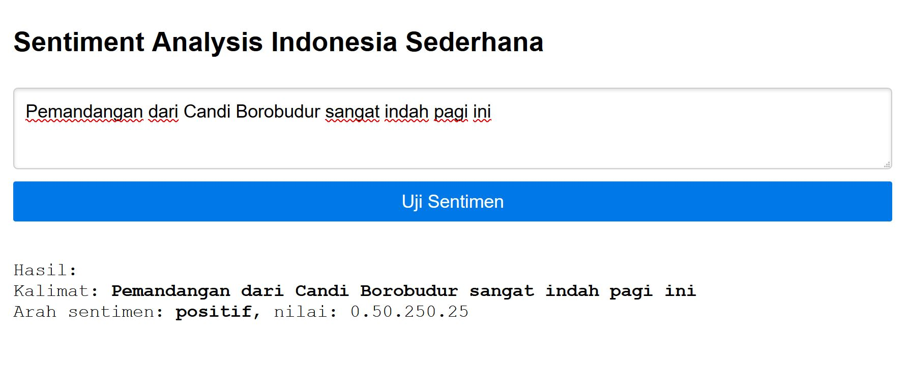

ID-PHPSentiAnalysis - Indonesian Sentiment Analysis in PHP
---------

This is an Indonesian Sentiment Classifier. Originated by James Hennessey and other contributors in phpInsight - Sentiment Analysis in PHP Project (https://github.com/JWHennessey/phpInsight). Some changes are made in the dataset (lib/PHPInsight/dictionaries and lib/PHPInsight/data) that originally use English Langguage converted to Indonesian Langguage. 

To be spesific, the list of words of positive and negative in lib/PHPInsight/dictionaries and lib/PHPInsight/data are generated by using modified Devid Haryalesmana's list of words on his project, ID-OpinionWords (https://github.com/masdevid/ID-OpinionWords). List of words in ignore, neutral and prefix data are original words list from phpInsight with modification/translation to Indonesia.

This project also added some web interfaces that can recieve input from user.

## How it work
The classifier use dictionary of words that is categories as positive, neutral, and negative. The calculation of possible sentiment is calculated by Naive Bayes Algorithm. The accuracy can be improved by modified the dictionary and algorithm.